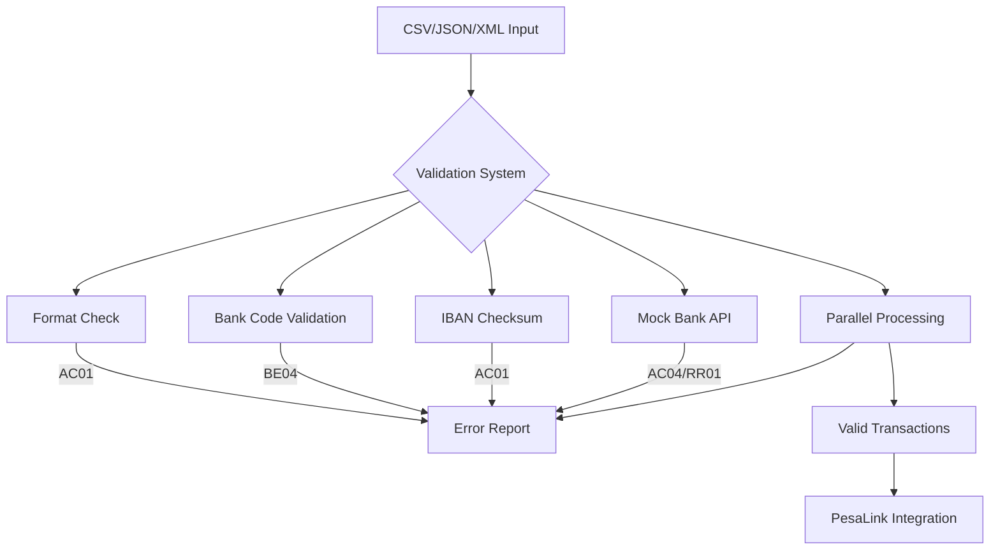

# Bulk Validator

A robust, extensible system for validating bulk payment account data from CSV, JSON, or XML files. Features include secure tokenization and encryption, delegated/admin lookup, multi-format reporting, email notification, and large file streaming.

---

## Features
- **Flexible Ingestion:** CSV, JSON, XML input via API or CLI.
- **Realistic Seeding:** Seeder scripts for valid/invalid local and IBAN accounts.
- **Modular Validation:** Account format, bank code, Luhn/IBAN, amount, reference ID.
- **Security:** Tokenizes and encrypts sensitive fields; supports secure delegated/admin lookup.
- **Streaming Support:** Chunked processing for large files.
- **Comprehensive Reporting:** Multi-format output (CSV, JSON, Excel), error breakdowns, summary stats.
- **Email Notification:** Automatic email on batch completion (configurable recipients).
- **.env Config:** All secrets/keys are managed via `.env` file.

---

## New Features in v2.0

### Banking Standard Compliance
- **SEPA/ISO 20022 Error Codes**:
  - **AC01**: Invalid account format
  - **AC04**: Closed account
  - **AM09**: Invalid amount
  - **BE04**: Invalid bank code

### Advanced Validation
- **Realistic Bank API Simulation**:
  - Simulates 5% closed accounts and 3% blocked accounts.
  - Run the seeder with advanced simulation:
    ```bash
    python seed_accounts.py --advanced
    ```

---

## Quick Start

### 1. Install Dependencies
```bash
pip install -r requirements.txt
```

### 2. Configure Environment
Create a `.env` file in your project root (or use `app/.env`). Example:
```
TOKEN_MAP_KEY=your_fernet_key_here
ADMIN_API_KEY=your_admin_api_key_here
EMAIL_USER=your_email@gmail.com
EMAIL_PASS=your_email_app_password
EMAIL_NOTIFY_TO=recipient@example.com
```
- **Generate a Fernet key:**
  ```python
  from cryptography.fernet import Fernet
  print(Fernet.generate_key().decode())
  ```
- **EMAIL_PASS** should be an App Password if using Gmail with 2FA.

### 3. Seed Demo Data
```bash
python seed_accounts.py
python seed_json_xml.py
```

### 4. Run the API
```bash
uvicorn app.main:app --reload
```

### 5. Upload Files via API
- **CSV:**
  ```bash
  curl -X POST http://127.0.0.1:8000/upload-csv -F "file=@seed_accounts.csv"
  ```
- **JSON:**
  ```bash
  curl -X POST http://127.0.0.1:8000/upload-json -H "Content-Type: application/json" --data-binary @seed_accounts.json
  ```
- **XML:**
  ```bash
  curl -X POST http://127.0.0.1:8000/upload-xml -F "file=@seed_accounts.xml"
  ```

### 6. Batch/Streaming Validation (Large Files)
```bash
python [batch_ingest.py](http://_vscodecontentref_/1) path/to/your.csv --type csv
python [batch_ingest.py](http://_vscodecontentref_/2) path/to/your.json --type json
python [batch_ingest.py](http://_vscodecontentref_/3) path/to/your.xml --type xml
```

### Parallel Processing
```bash
python [batch_ingest.py](http://_vscodecontentref_/5) path/to/your.csv --type csv --workers 4
python [batch_ingest.py](http://_vscodecontentref_/5) path/to/your.json --type json --workers 4
python [batch_ingest.py](http://_vscodecontentref_/5) path/to/your.xml --type xml --workers 4
```
- Use `--notify` to send email notification on completion.

### 7. Download Results
- Valid/invalid outputs and summary reports are written to the `output/` directory.
- Download via API:
  ```bash
  curl -O http://127.0.0.1:8000/download/<filename>
  ```

### 8. Token Lookup (Admin/Delegated)
- **API:**
  ```bash
  curl -X POST "http://127.0.0.1:8000/lookup-token?token=ACC-xxxxxxx" -H "admin_api_key: your_admin_api_key_here"
  ```
- **Delegated/Manual:**
  ```bash
  python view_decrypted_token_map.py --file output/token_map.json
  # or for a specific batch
  python view_decrypted_token_map.py --file output/token_map.json --batch 0
  ```

---

## Security & Encryption
- **Tokenization:** All sensitive fields (account_number, reference_id) are tokenized in outputs and API responses.
- **Encryption:** Only the token map is encrypted (Fernet) at rest; batch metadata is plaintext.
- **Audit:** Token-to-real-value mapping is only accessible via admin endpoint or decryptor script.
- **No Sensitive Logging:** Logs never include account numbers or reference IDs.
- **Admin/Delegated Lookup:**
  - `/lookup-token` endpoint (admin key required)
  - `view_decrypted_token_map.py` script (delegated/manual, loads `.env` automatically)
- **Email Notification:** Batch completion emails with summary and attachments (uses `EMAIL_USER`/`EMAIL_PASS` from `.env`).

## Extending & Advanced Usage
- Add new validation rules in `app/validators/account_validator.py`
- Add new ingestion formats in `batch_ingest.py`
- Adjust seeding logic in `seed_accounts.py` and `seed_json_xml.py`
- **Chunk Size:** Adjust `CHUNK_SIZE` in `batch_ingest.py` for larger/smaller batches.
- **IBAN Countries:** Add more country codes/lengths in `seed_accounts.py` as needed.

## Requirements
- Python 3.8+
- See `requirements.txt` for dependencies (FastAPI, pandas, ijson, cryptography, python-dotenv, yagmail, etc.)

## Project Structure
```
bulk-validator/
├── app/
│   ├── main.py                # FastAPI app, endpoints, validation logic
│   ├── validators/
│   ├── reporting.py           # Reporting/statistics logic
│   ├── email_notify.py        # Email notification logic
│   └── ...
├── batch_ingest.py            # CLI for large/streaming file validation
├── seed_accounts.py           # Seeder for CSV demo data
├── seed_json_xml.py           # Seeder for JSON/XML demo data
├── view_decrypted_token_map.py # Utility for delegated/manual token map decryption
├── decrypt_token_map.py       # (Legacy) decryptor utility
├── requirements.txt           # Python dependencies
├── output/                    # Output files (valid/invalid, token map)
├── .env                       # Environment variables (never commit to VCS)
└── README.md                  # This file
```

## Troubleshooting
- Make sure `.env` is present and has all required keys (see above).
- Ensure all dependencies are installed (`pip install -r requirements.txt`).
- For large files, use `batch_ingest.py` for efficient processing.
- For Gmail, use an App Password for `EMAIL_PASS` if 2FA is enabled.
- If you see `TOKEN_MAP_KEY environment variable must be set for encryption/decryption.`, check your `.env` or export the key.
- Check the `output/` directory for all results and logs.

---

## Validation Flow Diagram



---

## License
MIT

---

For questions or contributions, please open an issue or PR.
