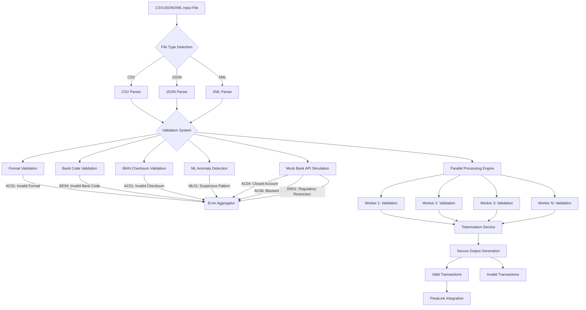

# Bulk Validator

A robust, extensible system for validating bulk payment account data from CSV, JSON, or XML files. Supports realistic seeding, modular validation (including IBAN), secure tokenization, and large file streaming.

---

## Features
- **Flexible Ingestion:** Supports CSV, JSON, and XML input via API or CLI.
- **Realistic Seeding:** Seeder scripts generate valid/invalid local and IBAN accounts for testing.
- **Modular Validation:** Checks account format, bank code, Luhn/IBAN checks, amount, and reference ID.
- **Security:** Tokenizes sensitive fields, never logs private data, supports secure admin lookup.
- **Streaming Support:** Handles large files in chunks for efficient processing.
- **Comprehensive Reporting:** Outputs valid/invalid files, error breakdowns, and summary stats.

---

## New Features in v2.0

### Banking Standard Compliance
- **SEPA/ISO 20022 Error Codes**:
  - **AC01**: Invalid account format
  - **AC04**: Closed account
  - **AM09**: Invalid amount
  - **BE04**: Invalid bank code

### Advanced Validation
- **Realistic Bank API Simulation**:
  - Simulates 5% closed accounts and 3% blocked accounts.
  - Run the seeder with advanced simulation:
    ```bash
    python seed_accounts.py --advanced
    ```

---

## Quick Start

### 1. Install Dependencies
```bash
pip install -r requirements.txt
```

### 2. Seed Demo Data
Generate CSV, JSON, and XML files (500 records each):
```bash
python seed_accounts.py
python seed_json_xml.py
```

### 3. Run the API
```bash
uvicorn app.main:app --reload
```

### 4. Upload Files via API
- **CSV:**
  ```bash
  curl -X POST http://127.0.0.1:8000/upload-csv -F "file=@seed_accounts.csv"
  ```
- **JSON:**
  ```bash
  curl -X POST http://127.0.0.1:8000/upload-json -H "Content-Type: application/json" --data-binary @seed_accounts.json
  ```
- **XML:**
  ```bash
  curl -X POST http://127.0.0.1:8000/upload-xml -F "file=@seed_accounts.xml"
  ```

### 5. Batch/Streaming Validation (Large Files)
```bash
python [batch_ingest.py](http://_vscodecontentref_/1) path/to/your.csv --type csv
python [batch_ingest.py](http://_vscodecontentref_/2) path/to/your.json --type json
python [batch_ingest.py](http://_vscodecontentref_/3) path/to/your.xml --type xml
```

### Parallel Processing
```bash
python [batch_ingest.py](http://_vscodecontentref_/5) path/to/your.csv --type csv --workers 4
python [batch_ingest.py](http://_vscodecontentref_/5) path/to/your.json --type json --workers 4
python [batch_ingest.py](http://_vscodecontentref_/5) path/to/your.xml --type xml --workers 4
```

### 6. Download Results
- Valid and invalid outputs are written to the `output/` directory.
- Download via API:
  ```bash
  curl -O http://127.0.0.1:8000/download/<filename>
  ```

---

## Validation Rules
- **Account Number:** 8-12 alphanumeric or valid IBAN (country-specific length, checksum)
- **Bank Code:** Must be from a realistic list (unless IBAN)
- **Amount:** Must be >0 and ≤10,000,000
- **Reference ID:** Must be non-empty and unique
- **IBAN:** Validates structure and MOD-97 checksum

## Security
- **Tokenization:** All sensitive fields (account_number, reference_id) are tokenized in outputs and API responses.
- **Audit:** Token-to-real-value mapping is stored in `output/token_map.json` for secure admin lookup.
- **No Sensitive Logging:** Logs never include account numbers or reference IDs.
- **Admin Lookup:** Secure `/lookup-token` endpoint allows admin to recover real values for tokens (requires API key).

## Extending
- Add new validation rules in `app/validators/account_validator.py`
- Add new ingestion formats in `batch_ingest.py`
- Adjust seeding logic in `seed_accounts.py` and `seed_json_xml.py`

## Requirements
- Python 3.8+
- See `requirements.txt` for dependencies (FastAPI, pandas, ijson, etc.)

## Project Structure
```
bulk-validator/
├── app/
│   ├── main.py                # FastAPI app, endpoints, validation logic
│   └── validators/
│       └── account_validator.py # Modular account validation rules
├── batch_ingest.py            # CLI for large/streaming file validation
├── seed_accounts.py           # Seeder for CSV demo data
├── seed_json_xml.py           # Seeder for JSON/XML demo data
├── requirements.txt           # Python dependencies
├── output/                    # Output files (valid/invalid, token map)
└── README.md                  # This file
```

## Advanced Usage
- **Chunk Size:** Adjust `CHUNK_SIZE` in `batch_ingest.py` for larger/smaller batches.
- **IBAN Countries:** Add more country codes/lengths in `seed_accounts.py` as needed.
- **Admin Security:** Set `ADMIN_API_KEY` in your environment for secure token lookup.

## Troubleshooting
- Ensure all dependencies are installed (`pip install -r requirements.txt`).
- For large files, use `batch_ingest.py` for efficient processing.
- Check the `output/` directory for all results and logs.

---

## Validation Flow Diagram


```

---

## License
MIT

---

For questions or contributions, please open an issue or PR.
